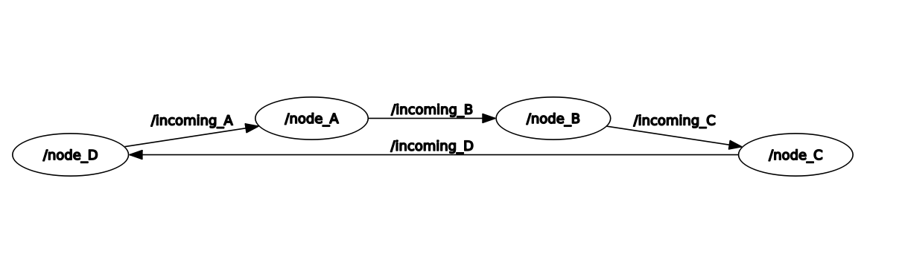
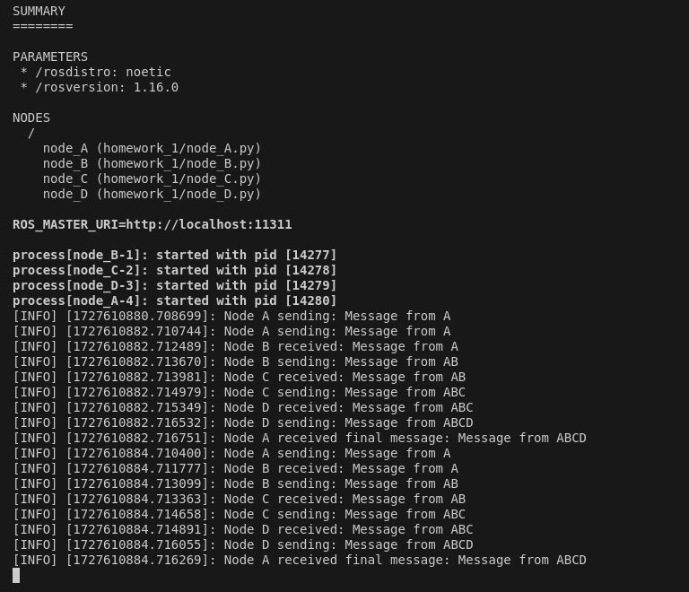

# CSC_5RO11 - Apprentissage pour la robotique
- **Name**: Shikun Wei
- **Email**: shikun.wei@ensta-paris.fr

## Homework 1

This project is a homework assignment designed to demonstrate inter-node communication in the Robot Operating System (ROS). It involves the implementation of four distinct ROS nodes: `node_A`, `node_B`, `node_C`, and `node_D`. Each node is responsible for sending and receiving messages, and each node modifies the message before passing it along to the next node in sequence. The message passes through all nodes in the system and finally returns to `node_A`.

### Topics and Remapping
The communication between nodes is handled by publishing and subscribing to topics, which are remapped in the launch file to ensure correct message flow. Below is the topic flow:

- `node_A` publishes on `outgoing_A`, which is remapped to `incoming_B`.
- `node_B` publishes on `outgoing_B`, which is remapped to `incoming_C`.
- `node_C` publishes on `outgoing_C`, which is remapped to `incoming_D`.
- `node_D` publishes on `outgoing_D`, which is remapped to `incoming_A`.

### Key Features
- Demonstrates message passing and topic remapping in ROS.
- Message type: `std_msgs/String`.
- Each node adds its corresponding letter ("A", "B", "C", or "D") to the message it receives, and forwards the updated message to the next node.

### Launch File
The package includes a launch file named `homework_1.launch`, which is used to simplify the process of launching multiple ROS nodes at once. This launch file is responsible for starting all the nodes (`node_A`, `node_B`, `node_C`, and `node_D`) and handling the necessary topic remappings to ensure proper communication between them.
The `homework_1.launch` file is located in the `launch/` directory and is structured as follows:

```xml
<launch>
    <!-- Launch node B -->
    <node pkg="homework_1" type="node_B.py" name="node_B" output="screen">
        <remap from="outgoing_B" to="incoming_C"/>
    </node>

    <!-- Launch node C -->
    <node pkg="homework_1" type="node_C.py" name="node_C" output="screen">
        <remap from="outgoing_C" to="incoming_D"/>
    </node>

    <!-- Launch node D -->
    <node pkg="homework_1" type="node_D.py" name="node_D" output="screen">
        <remap from="outgoing_D" to="incoming_A"/>
    </node>

        <!-- Launch node A -->
    <node pkg="homework_1" type="node_A.py" name="node_A" output="screen">
        <remap from="outgoing_A" to="incoming_B"/>
    </node>
</launch>
```

### Folder Structure of the Package
The folder structure is as follows:
```
homework_shikunwei/
├── build/
├── devel/
└──src/
    └── homework_1/
        ├── CMakeLists.txt
        ├── package.xml
        └── src/
            ├── node_A.py
            ├── node_B.py
            ├── node_C.py
            └── node_D.py     
        └── launch /
            ├── homework_1.launch
```

### Demonstration of result
We use the rqt introspection to plot all the nodes and their topics. This diagram illustrates the flow of messages between the ROS nodes. Messages are passed in a loop starting from `node_A` and going through `node_B`, `node_C`, and `node_D`, then back to `node_A`. Each node subscribes to the incoming message from the previous node and publishes a modified message to the next node.

The terminal output shows the log messages from each node:
- **Node A** starts the communication by sending "Message from A."
- **Node B** appends its identifier to the message and sends "Message from AB" to `node_C`.
- **Node C** continues the process with "Message from ABC."
- **Node D** finalizes the message as "Message from ABCD" and sends it back to `node_A`.

This output confirms that:
1. The message is successfully passed between all nodes.
2. Each node correctly modifies and forwards the message.
3. The communication loop completes as expected.

This demonstrates that the node-to-node communication and topic remapping are functioning correctly.


## Homework 2 - Facial Expression Recognition

This project focuses on facial expression recognition using three methods: LBP-based KNN, CNN, and Vision Transformer (ViT), to classify emotions into seven categories.

### Methods
- **LBP-based KNN**: Traditional machine learning approach using Local Binary Patterns for feature extraction.
- **CNN**: Deep learning model implemented with PyTorch for spatial feature learning.
- **ViT**: Transformer-based model leveraging global image features for high accuracy.

### Folder Structure
```
homework_shikunwei/
├── src/
    └── homework_2/
        ├── facial_expression.ipynb
```

### Results
- **KNN**: Lower accuracy with notable misclassifications.
- **CNN**: Improved accuracy but some confusion with similar expressions.
- **ViT**: Highest accuracy among all methods, showcasing the effectiveness of transformer-based models.

Model files are not included in the repository due to size constraints but can be downloaded in google drive https://drive.google.com/file/d/1eYonfhWd8m9WZhuqCndZSqv-gzAar42P/view?usp=drive_link.

## Homework 3 - Facial Expression Recognition
This project implements value iteration to solve Markov Decision Processes (MDP), aiming to find the optimal value function. Using Python, the algorithm iteratively updates state values based on transition probabilities, rewards, and a discount factor until convergence. The final output showcases the optimal actions and maximum expected rewards for each state.

### Folder Structure
```
homework_shikunwei/
├── src/
    └── homework_3/
        ├── iteration.py
        └── Report_homework3.pdf
```
